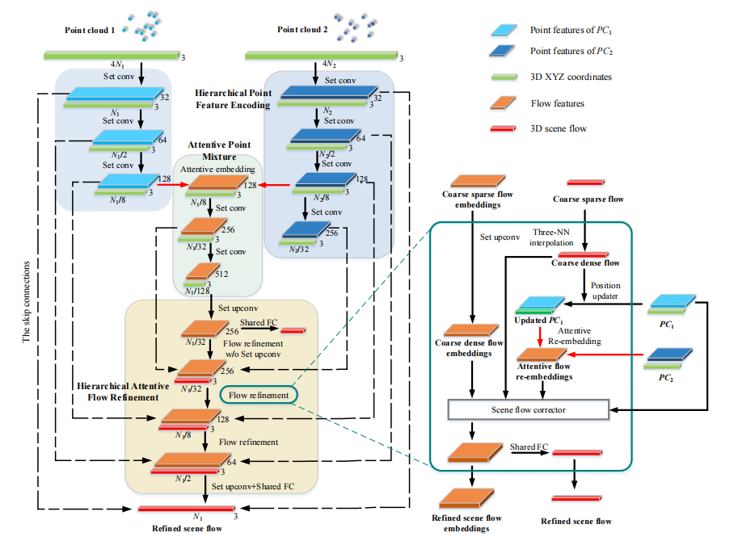
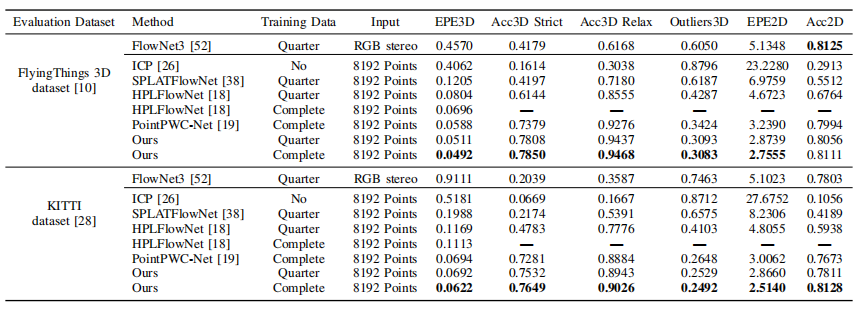

**Hierarchical Attention Learning of Scene Flow
in 3D Point Clouds**
==============================================================================================================================
This is the official implementation of HALFlowNet (IEEE TRANSACTIONS ON IMAGE PROCESSING), an end-to-end deep network for scene flow estimation created by Guangming Wang, Xinrui Wu, Zhe Liu and Hesheng Wang.


## Citation
If you find our work useful in your research, please cite:

        @ARTICLE{9435105,
        author={Wang, Guangming and Wu, Xinrui and Liu, Zhe and Wang, Hesheng},
        journal={IEEE Transactions on Image Processing}, 
        title={Hierarchical Attention Learning of Scene Flow in 3D Point Clouds}, 
        year={2021},
        volume={30},
        number={},
        pages={5168-5181},
        doi={10.1109/TIP.2021.3079796}}


## Abstract

Abstract—Scene flow represents the 3D motion of every point in the dynamic environments. Like the optical flow that represents the motion of pixels in 2D images, 3D motion representation of scene flow benefits many applications, such as autonomous driving and service robot. This paper studies the problem of scene flow estimation from two consecutive 3D point clouds. In this paper, a novel hierarchical neural network with double attention is proposed for learning the correlation of point features in adjacent frames and refining scene flow from coarse to fine layer by layer. The proposed network has a new more-for-less hierarchical architecture. The more-for-less means that the number of input points is greater than the number of output points for scene flow estimation, which brings more input information and balances the precision and resource consumption. In this hierarchical architecture, scene flow of different levels is generated and supervised respectively. A novel attentive embedding module is introduced to aggregate the features of adjacent points using a double attention method in a patch-to-patch manner. The proper layers for flow embedding and flow supervision are carefully considered in our network designment. Experiments show that the proposed network outperforms the state-of-the-art performance of 3D scene flow estimation on the FlyingThings3D and KITTI Scene Flow 2015 datasets. We also apply the proposed network to the realistic LiDAR odometry task, which is a key problem in autonomous driving. The experiment results demonstrate that our proposed network can outperform the ICP based method and shows good practical application ability. 


## Prequisites
    python 3.6.8
    CUDA 9.0
    TensorFlow 1.12.0  
    numpy 1.16.1  
    g++ 5.4.0 


## Usage

#### Compile Customized TF Operators
The TF operators are included under `tf_ops`, you need to compile them first by `make` under each ops subfolder (check `Makefile`). Update `arch` in the Makefiles for different <a href="https://en.wikipedia.org/wiki/CUDA#GPUs_supported">CUDA Compute Capability</a> that suits your GPU if necessary.

    cd ./tf_ops/sampling
    make
    cd ../grouping
    make
    cd ../3d_interpolation
    make
    cd ..

    

## Datasets

#### Data preprocess

For fair comparison with previous methods, we adopt the preprocessing steps in [HPLFlowNet](https://web.cs.ucdavis.edu/~yjlee/projects/cvpr2019-HPLFlowNet.pdf). Please refer to [repo](https://github.com/laoreja/HPLFlowNet). We also copy the preprocessing instructions here for your reference.

* FlyingThings3D:
Download and unzip the "Disparity", "Disparity Occlusions", "Disparity change", "Optical flow", "Flow Occlusions" for DispNet/FlowNet2.0 dataset subsets from the [FlyingThings3D website](https://lmb.informatik.uni-freiburg.de/resources/datasets/SceneFlowDatasets.en.html) (we used the paths from [this file](https://lmb.informatik.uni-freiburg.de/data/FlyingThings3D_subset/FlyingThings3D_subset_all_download_paths.txt), now they added torrent downloads)
. They will be upzipped into the same directory, `RAW_DATA_PATH`. Then run the following script for 3D reconstruction:

```bash
python3 data_preprocess/process_flyingthings3d_subset.py --raw_data_path RAW_DATA_PATH --save_path SAVE_PATH/FlyingThings3D_subset_processed_35m --only_save_near_pts
```

* KITTI Scene Flow 2015
Download and unzip [KITTI Scene Flow Evaluation 2015](http://www.cvlibs.net/download.php?file=data_scene_flow.zip) to directory `RAW_DATA_PATH`.
Run the following script for 3D reconstruction:

```bash
python3 data_preprocess/process_kitti.py RAW_DATA_PATH SAVE_PATH/KITTI_processed_occ_final
```

### Training
Train the network by running 
    
    sh command.sh  

Please reminder to specify the `mode`(train),`dataset`, `GPU`,`model`(path to HALFlowNet model), `data_ft3d_path`,`data_kitti_path`,`log_dir`,`num_point` in the scripts.


The training results and best model will be saved in `log_dir`.

### Evaluation

We provide pre-trained model in `./pretrained_model` directory.

Please run 

    sh command.sh 
    

Train the network by running `sh command.sh` please reminder to specify the `mode`(eval), `GPU`,`model`(path to HALFlowNet model), `data_ft3d_path`,`data_kitti_path`,`checkpoint_path`(path to pre-trained model for testing), `log_dir`.


### Quantitative results:




### Acknowledgments

We thank all the TIP reviewers and the following open-source project for the help of the implementations:
- [PointNet++](https://github.com/charlesq34/pointnet2) (Furthest Points Sampling and TF operators)
- [HPLFlowNet](https://github.com/laoreja/HPLFlowNet) (Data Preprocessing)

